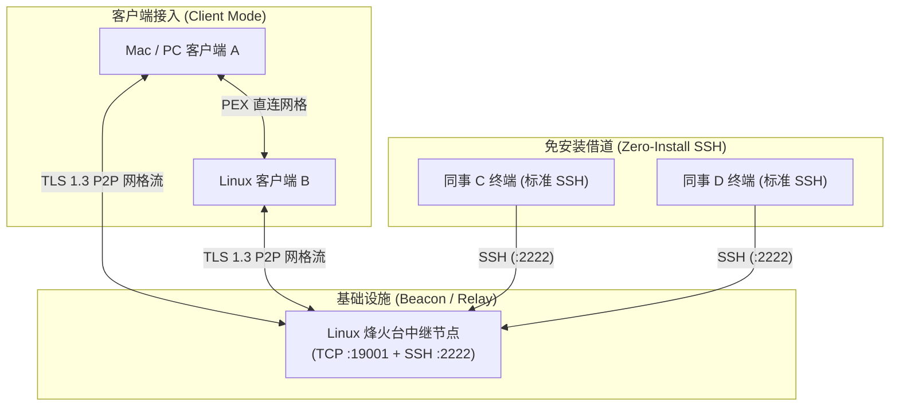
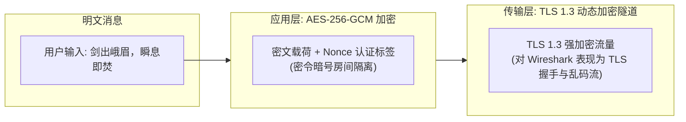
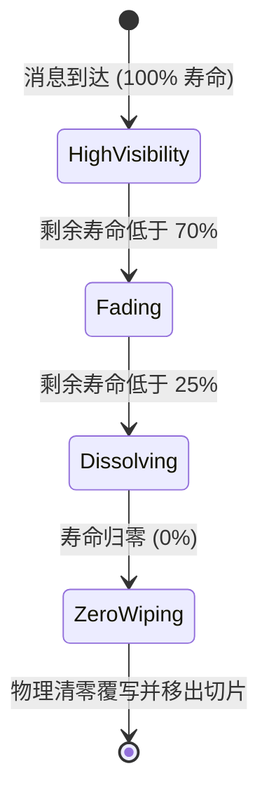
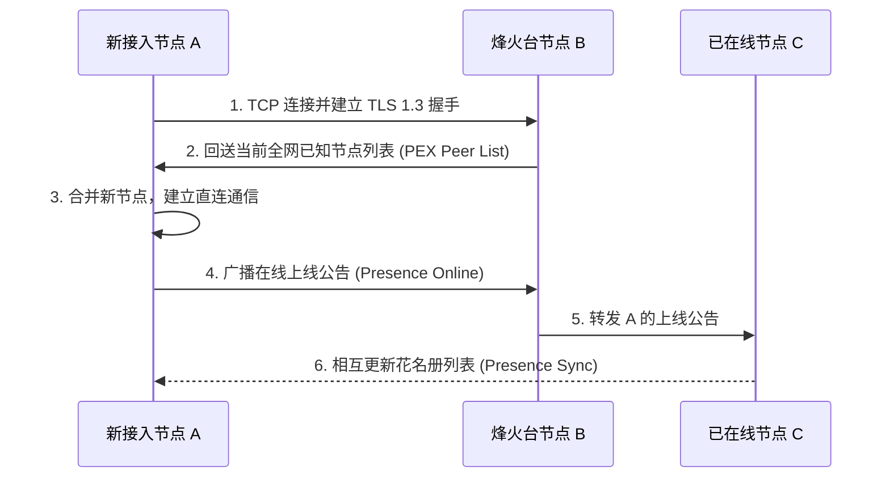

# 🏛️ mystic-chat 架构设计与技术实现 (Architecture & Design)

`mystic-chat`（密室）是一款定位于内网/局域网极客的去中心化、端到端加密、纯内存阅后即焚终端应用。本文档详细阐述其系统架构、安全加密模型、内存管理机制及核心网络协议设计。

---

## 1. 系统整体拓扑 (System Topology)

系统支持 **双轨接入模型**：既支持运行本地独立客户端组网，也支持通过标准的 SSH 客户端免安装借道接入。



---

## 2. 核心子系统与分层架构

代码采用清晰的模块化架构设计，位于 `internal/` 目录下：

```
cmd/
  └── mystic-chat/ (main.go 入口)
internal/
  ├── amnesia/       # 纯内存阅后即焚引擎（色阶衰减、字符瓦解、物理清零）
  ├── crypto/        # 传输层 TLS 1.3 自签证书协商与端到端 AES-256-GCM 加密
  ├── identity/      # 武侠随机身份生成、易容术与终端专属高光色彩映射
  ├── p2p/           # TCP Mesh 网格通信、自愈式 PEX 交换、花名册同步与心跳
  └── tui/           # Bubble Tea 终端交互界面、Wish 嵌入式 SSH 终端网关
```

---

## 3. 安全加密与防抓包设计 (Security & Anti-Sniffing)

为应对内网交换机镜像抓包、路由器层级流量分析及网络嗅探，`mystic-chat` 构建了 **传输层 + 载荷层** 双重立体防护：



### 3.1 传输层：全动态自签 TLS 1.3 隧道
- **启动时动态生成**：每次启动时在内存中动态生成 ECDSA (P-256) 临时密钥对及自签名 X.509 证书，不向磁盘写入任何密钥。
- **强制 TLS 1.3**：节点间握手强制使用 TLS 1.3 协议（`tls.VersionTLS13`），保证前向保密性（Forward Secrecy）。
- **抗路由器嗅探**：局域网中任何中间人、Wireshark、交换机抓包，均仅能捕获标准的 TLS 握手及加密 Application Data，无法还原任何明文或业务协议结构。

### 3.2 应用载荷层：AES-256-GCM 端到端加密
- **房间暗号密钥派生**：当通过 `-room <暗号>` 或 `/room <暗号>` 开启独立密令房间时，暗号经 SHA-256 派生为 32 字节高强度密钥。
- **AEAD 认证加密**：每条消息在打包发送前，使用独一无二的随机 Nonce 执行 AES-256-GCM 加密，保证不仅防窃听，而且无法被中间篡改。

---

## 4. 纯内存失忆与风化即焚引擎 (Amnesia Decay Engine)

即焚引擎完全在内存中维护消息队列，不依赖 SQLite、Redis 或任何本地磁盘文件。



### 4.1 色阶平滑渐变
消息生命周期划分为时间窗（默认 60s，支持 15s~120s）。通过线性比例计算当前字符应呈现的 24-bit 灰阶色彩：
$$\text{RGB} = \text{BaseColor} \times \left(0.25 + 0.75 \times \frac{t_{\text{remaining}}}{T_{\text{total}}}\right)$$

### 4.2 残卷随机风化瓦解
当消息剩余寿命低于 25% 时，文本进入瓦解状态：
- 每个字符按剩余时间递增概率（最高 85% 瓦解率）被伪随机替换为风化古籍字符：`·`、`*`、`~`、`°` 或空格。
- 模拟信件随风消散的视觉张力。

### 4.3 底层内存安全擦除 (Secure Zero-Wiping)
当寿命归零时：
1. 遍历底层字符串的底层字节切片，使用 `0x00` 执行全量覆写。
2. 从内存切片中切除该条目，断开引用指针，促使运行时垃圾回收器释放内存。

---

## 5. 去中心化网格通信与 PEX 花名册协议 (P2P & PEX)

系统在默认配置下完全运行于 **纯 TCP 安全网格模式**，避免广播 UDP 被企业路由器丢弃或阻断。



- **自愈式网格**：任意节点断开后，剩余节点依然通过对等连接保持通讯。
- **同机测试端口自避让**：本地同一台机运行多个客户端实例时，监听端口自动退避至 `:0`（系统随机可用端口），无需手动配置端口。

---

## 6. 免安装 SSH 终端网关设计 (Wish Gateway)

利用 Charmbracelet Wish 框架嵌入轻量级 SSH Server：
- **认证绕过 / 自动配发行头**：无需系统级用户凭证，任何终端执行 `ssh <IP> -p 2222` 即可直接拉起 Bubble Tea PTY 虚拟终端。
- **会话独立隔离**：每个 SSH 客户端拥有独立的上下文与虚拟终端窗口尺寸适配（SIGWINCH 监听）。
- **零残留保证**：会话结束（断开连接或 `Ctrl+C`）时，服务端仅回收内存会话对象，客户端主机不留任何痕迹。
